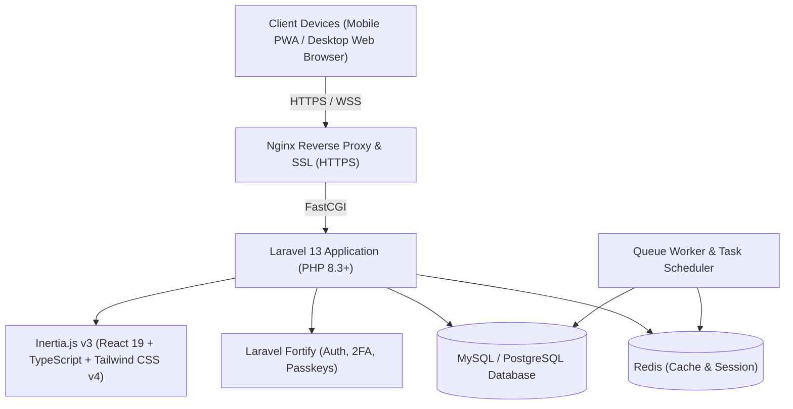

# 🏍️ Honda Customer Rewards & Loyalty Management System

[](https://laravel.com)
[](https://react.dev)
[](https://inertiajs.com)
[](https://tailwindcss.com)
[](https://www.typescriptlang.org)
[](https://web.dev/progressive-web-apps/)
[](LICENSE)

> **Honda Customer Rewards** adalah platform digital loyalitas pelanggan dan manajemen poin reward untuk jaringan dealer dan bengkel resmi **AHASS Honda**. Sistem ini memungkinkan pelanggan mengumpulkan poin dari berbagai aktivitas (servis berkala, pembelian suku cadang HGP/HGA, pembelian unit motor, referral, ulasan, dll.), menaikkan tier loyalitas, menukarkan hadiah eksklusif secara digital, serta menyediakan antarmuka scanner QR interaktif bagi staf dealer/AHASS.

---

## 📑 Daftar Isi
1. [Sekilas Aplikasi & Fitur Utama](#-sekilas-aplikasi--fitur-utama)
   - [Portal Pelanggan (Customer / Member)](#1-portal-pelanggan-customer--member)
   - [Portal Administrator & Staf AHASS](#2-portal-administrator--staf-ahass)
   - [Fitur Keamanan & Otentikasi](#3-fitur-keamanan--otentikasi)
   - [Progressive Web App (PWA)](#4-progressive-web-app-pwa)
2. [Sistem Tingkatan Member (Loyalty Tiers)](#-sistem-tingkatan-member-loyalty-tiers)
3. [Arsitektur & Tech Stack](#-arsitektur--tech-stack)
4. [Struktur Direktori Proyek](#-struktur-direktori-proyek)
5. [Panduan Instalasi Lokal (Development)](#-panduan-instalasi-lokal-development)
6. [Panduan Menuju Production (Production Deployment Guide - VPS)](#-panduan-menuju-production-production-deployment-guide)
   - [1. Spesifikasi & Kebutuhan Server](#1-spesifikasi--kebutuhan-server)
   - [2. Konfigurasi Environment (`.env.production`)](#2-konfigurasi-environment-envproduction)
   - [3. Instalasi Dependensi & Build Asset](#3-instalasi-dependensi--build-asset)
   - [4. Migrasi Database & Seeding Awal](#4-migrasi-database--seeding-awal)
   - [5. Pembuatan Akun Super Administrator](#5-pembuatan-akun-super-administrator)
   - [6. Optimasi Cache Laravel untuk Production](#6-optimasi-cache-laravel-untuk-production)
   - [7. Konfigurasi Queue Worker (Supervisor)](#7-konfigurasi-queue-worker-supervisor)
   - [8. Konfigurasi Task Scheduler (Cron Job)](#8-konfigurasi-task-scheduler-cron-job)
   - [9. Konfigurasi Web Server (Nginx)](#9-konfigurasi-web-server-nginx)
   - [10. Setup SSL / HTTPS (Let's Encrypt Certbot)](#10-setup-ssl--https-lets-encrypt-certbot)
7. [Panduan Deployment Khusus cPanel (Shared Hosting)](#-panduan-deployment-khusus-cpanel-shared-hosting)
   - [1. Persiapan File di Komputer Lokal](#1-persiapan-file-di-komputer-lokal-sebelum-upload)
   - [2. Konfigurasi PHP di cPanel (MultiPHP)](#2-konfigurasi-php-di-cpanel-multiphp)
   - [3. Membuat Database MySQL di cPanel](#3-membuat-database-mysql-di-cpanel)
   - [4. Upload & Struktur Direktori cPanel](#4-upload--struktur-direktori-cpanel)
   - [5. Konfigurasi .env di cPanel](#5-konfigurasi-env-di-cpanel)
   - [6. Migrasi Database & Storage Link](#6-migrasi-database--storage-link-di-cpanel)
   - [7. Setup Cron Job Scheduler di cPanel](#7-setup-cron-job-scheduler-di-cpanel)
   - [8. Aktivasi SSL / HTTPS di cPanel](#8-aktivasi-ssl--https-di-cpanel)
8. [Automasi Deployment & Pemeliharaan (CI/CD / Script)](#-automasi-deployment--pemeliharaan)
9. [Troubleshooting & Solusi Kendala Umum](#-troubleshooting--solusi-kendala-umum)
10. [Kontribusi & Lisensi](#-kontribusi--lisensi)

---

## 🚀 Sekilas Aplikasi & Fitur Utama

### 1. Portal Pelanggan (Customer / Member)
* **Digital Member E-Card**: Kartu keanggotaan digital interaktif dengan ID Member 10-digit unik, tier badge resmi, serta QR Code dinamis berbasis SVG/Canvas (`qr-code-styling`) yang siap dipindai di kasir/staf AHASS.
* **Tiering Progress Roadmap**: Visualisasi progress bar menuju tier berikutnya, poin seumur hidup (*lifetime points*), dan ringkasan hak istimewa (*privileges*).
* **Katalog Hadiah & Penukaran (Reward Catalog)**: Katalog hadiah seperti voucher servis AHASS, oli gratis AHM Oil MPX/SPX, diskon aksesori resmi (HGA), merchandise apparel Honda, hingga tiket undian berhadiah dengan sistem validasi masa berlaku & ketersediaan stok.
* **Tracking Penukaran Poin**: Riwayat status penukaran hadiah secara real-time (`Diproses / Hold`, `Disetujui / Claimed`, `Ditolak / Rejected`, `Dibatalkan / Cancelled`).
* **Riwayat Poin Transparan**: Log perolehan poin dari transaksi servis berkala, pembelian suku cadang, dan kegiatan promo lainnya beserta nama petugas dealer terkait.
* **Interactive Points Simulation**: Simulasi kalkulator di halaman depan untuk menghitung estimasi perolehan poin dan proyeksi tier keanggotaan.

### 2. Portal Administrator & Staf AHASS
* **Dashboard Analitik**: Metrik total member aktif, tingkat verifikasi akun, total poin beredar, total poin ditukarkan, perolehan harian, dan grafik aktivitas terpopuler.
* **Kamera Pemindai QR & Lookup Cepat**: Scanner kamera berbasis web (`@yudiel/react-qr-scanner`) dan pencarian manual (ID 10-digit, No. HP, Email) untuk mendeteksi data member secara instan.
* **Input Poin Transaksi AHASS**: Form penambahan poin berdasarkan aktivitas bengkel/dealer dengan kalkulasi otomatis dan deteksi instan peningkatan tier (*tier upgrade celebration*).
* **Verifikasi & Klaim Hadiah (Scan User)**: Scanner khusus untuk memverifikasi penyerahan voucher/hadiah fisik di kasir bengkel untuk mencegah penukaran ganda.
* **Manajemen Katalog Hadiah (CRUD)**: Pengaturan kuota stok, tanggal mulai & selesai promo, nilai poin, deskripsi, gambar reward, serta approval / penolakan permintaan klaim.
* **Manajemen Aktivitas Bengkel (CRUD)**: Pengaturan daftar kegiatan yang menghasilkan poin dan bobot poin standar.
* **Manajemen Pengguna (User Management)**: Daftar member, verifikasi email manual, pengubahan role (`user` / `admin`), pencarian, dan filtering status akun.

### 3. Fitur Keamanan & Otentikasi
* **Laravel Fortify Backend**: Backend otentikasi headless dengan proteksi CSRF, session hijacking protection, dan rate limiting.
* **Two-Factor Authentication (2FA)**: Mendukung TOTP Authenticator App (Google Authenticator, Authy) dan backup email 2FA code.
* **Passkeys / WebAuthn Biometrics**: Login modern tanpa kata sandi menggunakan sensor sidik jari, Face ID, atau kunci keamanan perangkat keras via `@laravel/passkeys`.
* **Role-Based Access Control**: Middleware otentikasi ketat pemisah antara member reguler dan staf administrator.

### 4. Progressive Web App (PWA)
* **Installable App**: Banner promosi ramah pengguna (`PwaPrompt`) yang memungkinkan instalasi website langsung ke layar utama (*Add to Home Screen*) di smartphone Android/iOS maupun desktop.
* **Service Worker Caching**: Akses aset offline responsif dan halaman darurat `offline.html` ketika koneksi internet terputus.
* **Update Notification**: Deteksi pembaruan versi baru secara otomatis dengan notifikasi toast untuk memuat ulang aplikasi ke versi termutakhir.

---

## 🏆 Sistem Tingkatan Member (Loyalty Tiers)

Tingkatan member dihitung secara otomatis berdasarkan akumulasi poin seumur hidup (*lifetime points*):

| Badge | Tingkat Keanggotaan | Syarat Poin (*Lifetime*) | Keuntungan & Hak Istimewa |
| :---: | :--- | :---: | :--- |
| 🥉 | **Bronze** | 0 – 499 Poin | Akses perolehan poin rewards di seluruh AHASS dan dealer resmi Honda. |
| 🥈 | **Silver** | 500 – 1.499 Poin | Akses katalog voucher oli MPX, diskon servis berkala, dan penukaran merchandise reguler. |
| 🥇 | **Gold** | 1.500 – 3.499 Poin | Prioritas booking servis AHASS, diskon suku cadang & aksesori resmi HGA, serta voucher berkala. |
| 💎 | **Platinum** | 3.500 – 6.999 Poin | Prioritas antrean servis AHASS, tiket undian ganda Hari Pelanggan, dan voucher potongan spesial. |
| 👑 | **Diamond** | 7.000+ Poin | Layanan VIP AHASS, merchandise premium eksklusif Honda, dan undangan kehormatan event tahunan. |

---

## 🛠️ Arsitektur & Tech Stack



* **Backend**:
  * **PHP**: 8.3 atau lebih tinggi
  * **Framework**: Laravel 13.x
  * **SPA Adapter**: Inertia.js Laravel v3 (`inertiajs/inertia-laravel`)
  * **Authentication**: Laravel Fortify 1.37+ (Passkeys, 2FA TOTP & Email)
  * **Type-Safe Routing**: Laravel Wayfinder
* **Frontend**:
  * **Library**: React 19 + React DOM 19
  * **Bahasa**: TypeScript 5.7+
  * **Styling**: Tailwind CSS v4 + `tw-animate-css`
  * **Komponen UI**: Radix UI Primitives + Lucide React Icons
  * **QR Code & Scanner**: `qr-code-styling` & `@yudiel/react-qr-scanner`
  * **Animasi & Interaksi**: Motion (Framer Motion) + Sonner Toast
  * **Build Tool**: Vite 8 + Vite Plus (`vp`) + React Compiler
* **PWA & Offline**:
  * Manifest: `public/manifest.json` & `public/site.webmanifest`
  * Service Worker: `public/sw.js` (Cache-first for static assets, network-first for navigation)
  * Offline Fallback: `public/offline.html`

---

## 📂 Struktur Direktori Proyek

```text
honda-customer-rewards/
├── app/
│   ├── Actions/Fortify/             # Aksi registrasi, reset password, update profil
│   ├── Enums/                       # MemberTier, UserRole, TeamRole
│   ├── Http/
│   │   ├── Controllers/             # Customer & Admin Dashboard, Scanner, Rewards, Users
│   │   └── Middleware/              # Inertia shared props, auth verified
│   └── Models/                      # User, Activity, ActivityHistory, Reward, PointExchange
├── database/
│   ├── factories/                   # Model factories untuk testing & seeding
│   ├── migrations/                  # Skema database (Users, Activities, Rewards, Exchanges)
│   └── seeders/                     # Seeder default (ActivitySeeder, RewardSeeder, DatabaseSeeder)
├── public/
│   ├── images/                      # Asset logo Honda, ilustrasi merchandise, voucher
│   ├── icons/                       # Icon PWA berbagai resolusi (192px, 512px, dll)
│   ├── manifest.json                # Web App Manifest PWA
│   ├── sw.js                        # Service Worker untuk caching & offline support
│   └── offline.html                 # Halaman cadangan saat koneksi internet terputus
├── resources/
│   ├── css/                         # Tailwind CSS v4 stylesheet
│   └── js/
│       ├── components/              # Komponen UI (PwaPrompt, Dialog, Navbar, Sidebar)
│       ├── layouts/                 # CustomerLayout, AdminLayout, AuthLayout
│       └── pages/
│           ├── welcome.tsx          # Landing page utama (Kalkulator poin & showcase)
│           ├── customer/            # Dashboard member, riwayat aktivitas, katalog klaim
│           └── admin/               # Dashboard analitik, scan QR, scan user, kelola reward
├── routes/
│   ├── web.php                      # Definisi rute aplikasi web & API internal
│   ├── auth.php                     # Rute otentikasi Fortify
│   └── console.php                  # Jadwal maintenance rutin (Laravel scheduler)
└── vite.config.ts                   # Konfigurasi bundler Vite, Wayfinder, React Compiler
```

---

## 💻 Panduan Instalasi Lokal (Development)

Untuk menjalankan proyek di lingkungan pengembangan lokal:

### 1. Prasyarat
- PHP >= 8.3 dengan ekstensi `pdo_sqlite`, `mbstring`, `fileinfo`, `curl`
- Composer 2.x
- Node.js >= 20.x & npm

### 2. Langkah Instalasi
```bash
# 1. Clone repository
git clone https://github.com/username/honda-customer-rewards.git
cd honda-customer-rewards

# 2. Salin environment file
cp .env.example .env

# 3. Jalankan setup otomatis composer
composer run setup

# 4. Jalankan database seeders untuk mengisi aktivitas & katalog hadiah bawaan
php artisan db:seed

# 5. Jalankan server lokal, worker antrean, dan compiler Vite secara paralel
composer run dev
```

Akses aplikasi di browser pada: `http://localhost:8000`

---

## 🚀 Panduan Menuju Production (Production Deployment Guide)

Ikuti langkah-langkah di bawah ini untuk memastikan sistem berjalan aman, cepat, dan handal di lingkungan server produksi (VPS Ubuntu/Debian, AWS EC2, DigitalOcean Droplet, atau server on-premise dealer Honda).

### 1. Spesifikasi & Kebutuhan Server

* **Sistem Operasi**: Ubuntu 22.04 LTS atau Ubuntu 24.04 LTS (Direkomendasikan)
* **Spesifikasi Minimal**: 2 vCPU, 2 GB RAM, 25 GB SSD Storage
* **Spesifikasi Disarankan**: 4 vCPU, 4-8 GB RAM, 50 GB NVMe SSD (Mendukung traffic tinggi pada event Honda)
* **Paket Perangkat Lunak Wajib**:
  ```bash
  sudo apt update && sudo apt upgrade -y
  sudo apt install -y nginx git curl unzip supervisor redis-server \
      php8.3-fpm php8.3-cli php8.3-mysql php8.3-sqlite3 php8.3-curl \
      php8.3-mbstring php8.3-xml php8.3-zip php8.3-bcmath php8.3-intl
  ```
* **Node.js LTS & Composer**:
  ```bash
  # Install Composer
  curl -sS https://getcomposer.org/installer | sudo php -- --install-dir=/usr/local/bin --filename=composer

  # Install Node.js v20 LTS
  curl -fsSL https://deb.nodesource.com/setup_20.x | sudo -E bash -
  sudo apt install -y nodejs
  ```

---

### 2. Konfigurasi Environment (`.env.production`)

Buat file `.env` pada direktori root proyek di server (`/var/www/honda-customer-rewards`):

```env
# ==============================================================================
# IDENTITAS & MODE APLIKASI
# ==============================================================================
APP_NAME="Honda Customer Rewards"
APP_ENV=production
APP_KEY=base64:... # Dihasilkan via 'php artisan key:generate'
APP_DEBUG=false
APP_URL=https://rewards.dealerhonda.co.id

APP_LOCALE=id
APP_FALLBACK_LOCALE=en

# ==============================================================================
# LOGGING
# ==============================================================================
LOG_CHANNEL=daily
LOG_LEVEL=error

# ==============================================================================
# DATABASE (Gunakan MySQL / PostgreSQL untuk skala Production)
# ==============================================================================
DB_CONNECTION=mysql
DB_HOST=127.0.0.1
DB_PORT=3306
DB_DATABASE=honda_rewards_prod
DB_USERNAME=honda_dbuser
DB_PASSWORD=GunakanPasswordDatabaseYangSangatKuat123!

# ==============================================================================
# CACHE, SESSION, & QUEUE (Sangat disarankan memakai Redis)
# ==============================================================================
SESSION_DRIVER=redis
SESSION_LIFETIME=120
SESSION_ENCRYPT=true

CACHE_STORE=redis
QUEUE_CONNECTION=redis

REDIS_CLIENT=phpredis
REDIS_HOST=127.0.0.1
REDIS_PASSWORD=null
REDIS_PORT=6379

# ==============================================================================
# EMAIL GATEWAY (Wajib untuk 2FA Email & Verifikasi Akun Baru)
# ==============================================================================
MAIL_MAILER=smtp
MAIL_HOST=smtp.mailgun.org
MAIL_PORT=587
MAIL_USERNAME=postmaster@rewards.dealerhonda.co.id
MAIL_PASSWORD=your-smtp-secret-password
MAIL_ENCRYPTION=tls
MAIL_FROM_ADDRESS="no-reply@dealerhonda.co.id"
MAIL_FROM_NAME="Honda Customer Rewards"

# ==============================================================================
# FRONTEND VITE INTEGRATION
# ==============================================================================
VITE_APP_NAME="${APP_NAME}"
```

> [!CAUTION]
> Pastikan `APP_DEBUG=false` di lingkungan produksi. Jika dibiarkan `true`, error trace internal berpotensi membocorkan kredensial database dan kunci enkripsi aplikasi kepada publik.

---

### 3. Instalasi Dependensi & Build Asset

Jalankan perintah berikut di direktori proyek:

```bash
# Set folder proyek
cd /var/www/honda-customer-rewards

# Pasang dependensi PHP tanpa dependensi dev
composer install --no-dev --prefer-dist --optimize-autoloader --no-interaction

# Pasang dependensi Node.js & bangun bundle frontend produksi
npm ci
npm run build
```

---

### 4. Migrasi Database & Seeding Awal

Jalankan migrasi tabel skema database dan data seeder bawaan (katalog hadiah awal & daftar aktivitas AHASS):

```bash
# Jalankan migrasi tabel
php artisan migrate --force

# Isi data seeder awal (Aktivitas poin & Hadiah penukaran)
php artisan db:seed --class=ActivitySeeder --force
php artisan db:seed --class=RewardSeeder --force

# Buat symbolic link direktori publik untuk penyimpanan file upload
php artisan storage:link
```

---

### 5. Pembuatan Akun Super Administrator

Setelah database terpasang, buat akun Super Administrator pertama menggunakan Laravel Tinker:

```bash
php artisan tinker --execute="
\$admin = App\Models\User::create([
    'name' => 'Super Administrator Honda',
    'email' => 'admin@dealerhonda.co.id',
    'password' => bcrypt('PasswordAdminSangatKuat!@#2026'),
    'role' => App\Enums\UserRole::Admin,
    'email_verified_at' => now(),
    'phone_number' => '081234567890',
    'address' => 'Kantor Pusat Dealer Honda',
]);
echo 'Administrator berhasil dibuat dengan ID: ' . \$admin->id . PHP_EOL;
"
```

---

### 6. Optimasi Cache Laravel untuk Production

Laravel menyediakan mekanisme caching manifest rute, konfigurasi, dan event untuk memangkas waktu pemrosesan request secara drastis:

```bash
# Hapus cache lama terlebih dahulu
php artisan optimize:clear

# Kompilasi cache produksi
php artisan config:cache
php artisan route:cache
php artisan view:cache
php artisan event:cache

# Periksa hak akses file (Permission)
sudo chown -R www-data:www-data /var/www/honda-customer-rewards/storage /var/www/honda-customer-rewards/bootstrap/cache
sudo chmod -R 775 /var/www/honda-customer-rewards/storage /var/www/honda-customer-rewards/bootstrap/cache
```

> [!NOTE]
> Setiap kali Anda memperbarui file `.env` atau menambahkan rute baru di `routes/web.php`, Anda **wajib** menjalankan ulang `php artisan config:cache` dan `php artisan route:cache`.

---

### 7. Konfigurasi Queue Worker (Supervisor)

Antrean email verifikasi, notifikasi 2FA, dan pemrosesan poin berjalan secara asynchronous di background menggunakan worker. Gunakan **Supervisor** agar worker selalu aktif dan otomatis restart jika terjadi kegagalan.

Buat file konfigurasi supervisor: `/etc/supervisor/conf.d/honda-rewards-worker.conf`

```ini
[program:honda-rewards-worker]
process_name=%(program_name)s_%(process_num)02d
command=php /var/www/honda-customer-rewards/artisan queue:work redis --sleep=3 --tries=3 --max-time=3600
autostart=true
autorestart=true
stopasgroup=true
killasgroup=true
user=www-data
numprocs=2
redirect_stderr=true
stdout_logfile=/var/www/honda-customer-rewards/storage/logs/worker.log
stopwaitsecs=3600
```

Aktifkan konfigurasi supervisor:
```bash
sudo supervisorctl reread
sudo supervisorctl update
sudo supervisorctl start honda-rewards-worker:*
```

---

### 8. Konfigurasi Task Scheduler (Cron Job)

Sistem memiliki pembersihan data kadaluarsa (misalnya undangan tim atau masa penukaran poin). Daftarkan Laravel Scheduler ke crontab server:

```bash
sudo crontab -u www-data -e
```

Tambahkan baris berikut di baris paling bawah:
```cron
* * * * * cd /var/www/honda-customer-rewards && php artisan schedule:run >> /dev/null 2>&1
```

---

### 9. Konfigurasi Web Server (Nginx)

Nginx direkomendasikan sebagai reverse proxy performa tinggi. Konfigurasi di bawah ini telah dioptimalkan untuk Laravel, Inertia SPA, HTTP/2, proteksi header keamanan, serta aturan cache khusus PWA (*Service Worker tidak boleh di-cache permanen oleh browser!*).

Buat file `/etc/nginx/sites-available/honda-rewards.conf`:

```nginx
server {
    listen 80;
    listen [::]:80;
    server_name rewards.dealerhonda.co.id;
    return 301 https://$host$request_uri;
}

server {
    listen 443 ssl http2;
    listen [::]:443 ssl http2;
    server_name rewards.dealerhonda.co.id;

    root /var/www/honda-customer-rewards/public;
    index index.php;

    charset utf-8;

    # SSL Configuration (Akan diisi otomatis oleh Certbot)
    # ssl_certificate /etc/letsencrypt/live/rewards.dealerhonda.co.id/fullchain.pem;
    # ssl_certificate_key /etc/letsencrypt/live/rewards.dealerhonda.co.id/privkey.pem;

    # Security Headers
    add_header X-Frame-Options "SAMEORIGIN" always;
    add_header X-Content-Type-Options "nosniff" always;
    add_header X-XSS-Protection "1; mode=block" always;
    add_header Referrer-Policy "strict-origin-when-cross-origin" always;
    add_header Permissions-Policy "camera=(self), geolocation=(), microphone=()" always;

    # Upload size limit (Untuk upload gambar reward/bukti servis)
    client_max_body_size 20M;

    # PWA Service Worker & Manifest: JANGAN CACHE DI BROWSER AGAR UPDATE LANGSUNG TERDETEKSI
    location ~* (sw\.js|manifest\.json|site\.webmanifest)$ {
        add_header Cache-Control "no-cache, no-store, must-revalidate";
        add_header Pragma "no-cache";
        expires 0;
        access_log off;
    }

    # Static Assets Caching (Vite build assets)
    location ~* \.(css|js|jpg|jpeg|png|gif|ico|svg|webp|woff|woff2|ttf|eot)$ {
        expires 1y;
        add_header Cache-Control "public, no-transform, immutable";
        access_log off;
    }

    location / {
        try_files $uri $uri/ /index.php?$query_string;
    }

    location = /favicon.ico { access_log off; log_not_found off; }
    location = /robots.txt  { access_log off; log_not_found off; }

    error_page 404 /index.php;

    location ~ \.php$ {
        fastcgi_pass unix:/var/run/php/php8.3-fpm.sock;
        fastcgi_param SCRIPT_FILENAME $realpath_root$fastcgi_script_name;
        include fastcgi_params;
        fastcgi_hide_header X-Powered-By;
        fastcgi_read_timeout 300;
    }

    location ~ /\.(?!well-known).* {
        deny all;
    }
}
```

Aktifkan situs dan uji konfigurasi Nginx:
```bash
sudo ln -s /etc/nginx/sites-available/honda-rewards.conf /etc/nginx/sites-enabled/
sudo nginx -t
sudo systemctl reload nginx
```

---

### 10. Setup SSL / HTTPS (Let's Encrypt Certbot)

> [!IMPORTANT]
> **HTTPS bersifat WAJIB untuk Production!**
> Fitur scanner kamera (`@yudiel/react-qr-scanner`), Passkeys / Biometrics (WebAuthn), dan Progressive Web App (PWA) diblokir oleh peramban modern jika website tidak diakses melalui koneksi HTTPS yang aman.

Jalankan perintah Certbot untuk menerbitkan sertifikat SSL gratis dari Let's Encrypt:

```bash
sudo apt install -y certbot python3-certbot-nginx
sudo certbot --nginx -d rewards.dealerhonda.co.id
```

Pilih opsi untuk otomatis me-redirect seluruh traffic HTTP ke HTTPS. Uji perpanjangan otomatis sertifikat:
```bash
sudo certbot renew --dry-run
```

---

## 🌐 Panduan Deployment Khusus cPanel (Shared Hosting)

Panduan ini ditujukan bagi Anda yang ingin mendeploy sistem **Honda Customer Rewards** ke shared hosting berbasis **cPanel**.

### 1. Persiapan File di Komputer Lokal (Sebelum Upload)

Di cPanel, kita tidak perlu menginstall Node.js karena asset dapat kita build di komputer lokal:

```bash
# 1. Kompilasi asset frontend React & CSS untuk production
npm run build

# 2. Pastikan dependensi vendor PHP bersih dan teroptimasi
composer install --no-dev --prefer-dist --optimize-autoloader

# 3. Arsipkan (ZIP) seluruh folder proyek
# PERHATIAN: JANGAN sertakan folder 'node_modules/' dan '.git/' untuk menghemat ukuran zip!
```

> [!TIP]
> Folder yang wajib ikut ke dalam zip: `app/`, `bootstrap/`, `config/`, `database/`, `public/` (termasuk `public/build/`), `resources/`, `routes/`, `storage/`, `vendor/`, `artisan`, `composer.json`, dan `.env.example`.

---

### 2. Konfigurasi PHP di cPanel (MultiPHP)

1. Buka cPanel, cari menu **MultiPHP Manager**:
   - Pilih domain atau subdomain Anda.
   - Ubah versi PHP ke **PHP 8.3** (misal: `ea-php83` atau `alt-php83`). Klik **Apply**.
2. Buka menu **Select PHP Version** (jika ada CloudLinux) atau **PHP Extensions**:
   - Pastikan ekstensi berikut aktif: `fileinfo`, `pdo_mysql`, `mbstring`, `curl`, `zip`, `bcmath`, `intl`, `openssl`.
3. Buka menu **MultiPHP INI Editor**:
   - Pilih domain Anda, lalu atur direktif:
     - `memory_limit` = `512M`
     - `max_execution_time` = `300`
     - `upload_max_filesize` = `25M`
     - `post_max_size` = `32M`
     - `display_errors` = `Off` (Disabled)
     - `log_errors` = `On` (Enabled)

---

### 3. Membuat Database MySQL di cPanel

1. Buka menu **MySQL Database Wizard** di cPanel:
   - **Langkah 1**: Buat nama database, contoh: `username_hondarewards`.
   - **Langkah 2**: Buat user database, contoh: `username_dbuser` beserta password yang aman.
   - **Langkah 3**: Centang **ALL PRIVILEGES** untuk menghubungkan user ke database.
2. Catat nama database, user, dan password tersebut.

---

### 4. Upload & Struktur Direktori cPanel

Ada 2 cara penempatan file tergantung apakah Anda menggunakan Subdomain atau Domain Utama:

#### Opsi A: Menggunakan Subdomain (Paling Rapi & Direkomendasikan) ⭐
Contoh: `rewards.dealerhonda.co.id`
1. Di cPanel, buka menu **Domains** / **Subdomains**.
2. Buat subdomain baru, dan atur **Document Root** langsung mengarah ke subfolder `public`:
   ```text
   Document Root: /home/username/honda-rewards/public
   ```
3. Buka **File Manager**, buat folder `/home/username/honda-rewards/`.
4. Upload file `.zip` proyek Anda ke folder tersebut, lalu klik **Extract**.
5. Struktur file langsung rapi tanpa perlu memindahkan folder apapun!

#### Opsi B: Menggunakan Domain Utama (`public_html`)
1. Buka **File Manager**, di root `/home/username/` buat folder baru bernama `honda-core`.
2. Upload dan ekstrak file zip proyek Anda ke dalam folder `/home/username/honda-core/`.
3. Masuk ke `/home/username/honda-core/public/`, pilih **Select All**, lalu **Move (Pindahkan)** semua isinya langsung ke dalam folder `/home/username/public_html/`.
4. Buka file `/home/username/public_html/index.php` menggunakan **Code Editor** cPanel, lalu sesuaikan 2 baris path berikut:
   ```php
   // Ganti baris autoload:
   require __DIR__.'/../honda-core/vendor/autoload.php';

   // Ganti baris bootstrap app:
   $app = require_once __DIR__.'/../honda-core/bootstrap/app.php';
   ```

---

### 5. Konfigurasi `.env` di cPanel

1. Di File Manager, aktifkan opsi **Show Hidden Files (dotfiles)** pada menu Settings di pojok kanan atas.
2. Temukan file `.env.example` lalu rename menjadi `.env` (atau edit file `.env` yang ada).
3. Sesuaikan parameter berikut:
   ```env
   APP_NAME="Honda Customer Rewards"
   APP_ENV=production
   APP_KEY=base64:... # Jika kosong, generate via Terminal cPanel: php artisan key:generate
   APP_DEBUG=false
   APP_URL=https://rewards.dealerhonda.co.id

   # Database cPanel
   DB_CONNECTION=mysql
   DB_HOST=127.0.0.1
   DB_PORT=3306
   DB_DATABASE=username_hondarewards
   DB_USERNAME=username_dbuser
   DB_PASSWORD=password_database_anda

   # Driver untuk Shared Hosting (Gunakan file atau database jika Redis tidak tersedia)
   SESSION_DRIVER=file
   CACHE_STORE=file
   QUEUE_CONNECTION=database

   # Email SMTP (Wajib untuk 2FA Email & Verifikasi)
   MAIL_MAILER=smtp
   MAIL_HOST=mail.dealerhonda.co.id
   MAIL_PORT=465
   MAIL_USERNAME=no-reply@dealerhonda.co.id
   MAIL_PASSWORD=password_email_anda
   MAIL_ENCRYPTION=ssl
   MAIL_FROM_ADDRESS="no-reply@dealerhonda.co.id"
   MAIL_FROM_NAME="Honda Customer Rewards"
   ```

---

### 6. Migrasi Database & Storage Link di cPanel

#### Jika Hosting Anda Menyediakan Menu "Terminal":
Buka menu **Terminal** di cPanel:
```bash
# Masuk ke folder proyek Anda
cd /home/username/honda-rewards  # (atau honda-core)

# Generate App Key (jika belum ada)
php artisan key:generate

# Jalankan migrasi tabel database
php artisan migrate --force

# Jalankan seeder aktivitas & reward default
php artisan db:seed --class=ActivitySeeder --force
php artisan db:seed --class=RewardSeeder --force

# Hubungkan symbolic link storage gambar
php artisan storage:link

# Optimasi cache konfigurasi
php artisan config:cache
php artisan route:cache
php artisan view:cache
```

#### Jika Hosting Anda TIDAK Menyediakan Menu Terminal:
1. **Migrasi Database**: Export database dari komputer lokal Anda melalui phpMyAdmin/HeidiSQL, lalu Import file `.sql` tersebut ke phpMyAdmin di cPanel.
2. **Storage Link**: Tambahkan rute sementara di `routes/web.php`:
   ```php
   Route::get('/artisan-storage-link', function () {
       \Illuminate\Support\Facades\Artisan::call('storage:link');
       return 'Storage Link Berhasil Dibuat!';
   });
   ```
   Buka URL `https://domainanda.com/artisan-storage-link` di browser sekali saja, lalu hapus kembali baris rute tersebut.

---

### 7. Setup Cron Job Scheduler di cPanel

Agar pembersihan data kedaluwarsa dan antrean email berjalan otomatis:
1. Buka menu **Cron Jobs** di cPanel.
2. Pada bagian **Common Settings**, pilih **Once Per Minute** (`* * * * *`).
3. Pada kolom **Command**, masukkan perintah:
   ```bash
   /usr/local/bin/php /home/username/honda-rewards/artisan schedule:run >> /dev/null 2>&1
   ```
   *(Sesuaikan `/home/username/honda-rewards` dengan path folder proyek Anda).*
4. Klik **Add New Cron Job**.

---

### 8. Aktivasi SSL / HTTPS di cPanel

> [!IMPORTANT]
> Fitur **Kamera Scanner QR**, **Passkeys Biometrik**, dan **PWA** wajib menggunakan HTTPS!

1. Buka menu **SSL/TLS Status** di cPanel.
2. Centang nama domain/subdomain Anda.
3. Klik tombol **Run AutoSSL**. Tunggu beberapa menit hingga sertifikat SSL terpasang dan icon gembok hijau muncul.
4. Buka menu **Domains**, aktifkan opsi **Force HTTPS Redirect**.

---

## 🔄 Automasi Deployment & Pemeliharaan (CI/CD / Script)

Untuk memudahkan proses rilis versi baru tanpa downtime (*zero-downtime deployment*), buat skrip bash bernama `deploy.sh` di server:

```bash
#!/usr/bin/env bash
set -e

echo "🚀 Memulai proses deployment Honda Customer Rewards..."

cd /var/www/honda-customer-rewards

# 1. Aktifkan Maintenance Mode dengan bypass secret key
php artisan down --secret="honda-maintenance-pass-2026" --render="errors::503"

# 2. Ambil kode terbaru dari Git
git fetch origin main
git reset --hard origin/main

# 3. Pasang dependensi PHP
composer install --no-dev --no-interaction --prefer-dist --optimize-autoloader

# 4. Pasang dependensi Node & compile frontend asset
npm ci
npm run build

# 5. Jalankan migrasi database
php artisan migrate --force

# 6. Bersihkan & bangun ulang cache
php artisan optimize:clear
php artisan config:cache
php artisan route:cache
php artisan view:cache
php artisan event:cache

# 7. Pastikan permission folder storage benar
sudo chown -R www-data:www-data storage bootstrap/cache
sudo chmod -R 775 storage bootstrap/cache

# 8. Restart queue worker agar membaca kode terbaru
sudo supervisorctl restart honda-rewards-worker:*

# 9. Matikan maintenance mode
php artisan up

echo "✅ Deployment Honda Customer Rewards berhasil diselesaikan!"
```

Berikan hak eksekusi pada skrip:
```bash
chmod +x /var/www/honda-customer-rewards/deploy.sh
```

---

## 🔍 Troubleshooting & Solusi Kendala Umum

| Masalah / Gejala | Kemungkinan Penyebab | Solusi Penanganan |
| :--- | :--- | :--- |
| **Kamera scanner tidak mau aktif / layar hitam** | Website diakses melalui HTTP biasa (bukan HTTPS) atau izin kamera ditolak oleh pengguna. | Pastikan website telah terpasang SSL (HTTPS). Cek perizinan browser pada icon gembok URL dan pastikan akses kamera diberi izin (*Allow*). |
| **Vite Exception: "Unable to locate file in Vite manifest"** | Asset frontend belum dibuild di server atau file `public/build/manifest.json` tidak terbaca. | Jalankan `npm run build` di direktori proyek, lalu bersihkan cache view dengan `php artisan view:clear`. |
| **PWA tidak memunculkan tombol instalasi / update** | Browser menganggap aplikasi belum memenuhi kriteria PWA, atau `manifest.json` belum ter-load. | Buka DevTools Chrome -> tab **Application** -> periksa bagian **Manifest** & **Service Workers**. Pastikan icon 192px dan 512px dapat diakses dengan status HTTP 200. |
| **Passkeys / Face ID gagal didaftarkan** | Domain di `.env` (`APP_URL`) tidak cocok dengan domain yang sedang diakses di browser (*Relying Party ID Mismatch*). | Pastikan domain pada `APP_URL` di file `.env` tepat sama dengan nama domain publik (misal: `https://rewards.dealerhonda.co.id`). |
| **Error 419: Page Expired saat Submit Form** | Token CSRF kadaluarsa atau permission penyimpanan session (`storage/framework/sessions`) tidak dapat ditulis oleh Nginx/PHP-FPM. | Periksa izin folder: `sudo chown -R www-data:www-data storage` dan `sudo chmod -R 775 storage`. |
| **Poin transaksi tidak bertambah setelah scanner submit** | Worker antrean mati atau terjadi kegagalan koneksi database. | Periksa log status supervisor: `sudo supervisorctl status` dan log error Laravel di `storage/logs/laravel.log`. |

---

## 👥 Peran Pengguna & Kredensial Default

Setelah menjalankan `php artisan db:seed`, akun uji coba berikut dapat digunakan pada tahap staging:

* **Akun Pelanggan (Member)**:
  * **Email**: `test@example.com`
  * **Password**: `password`
  * **Fitur**: Kartu Member QR, Katalog Penukaran Hadiah, Riwayat Poin, Roadmap Tier.
* **Akun Administrator**:
  * Dibuat secara mandiri via Artisan Tinker sesuai petunjuk pada [Langkah 5](#5-pembuatan-akun-super-administrator).
  * **Fitur**: Dashboard Analisis, Scanner Poin AHASS, Verifikasi Hadiah, Pengaturan Aktivitas, Pengaturan Hadiah.

---

## 📄 Lisensi

Hak Cipta © 2026 Sistem Loyalitas & Hadiah Pelanggan Honda. Seluruh hak cipta dilindungi undang-undang.
Kode sumber dilisensikan di bawah [MIT License](LICENSE).
